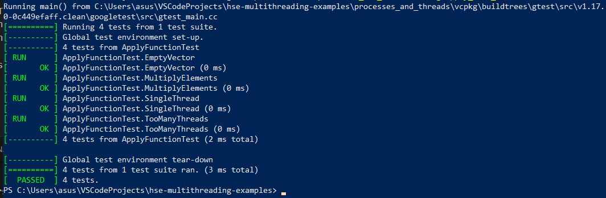
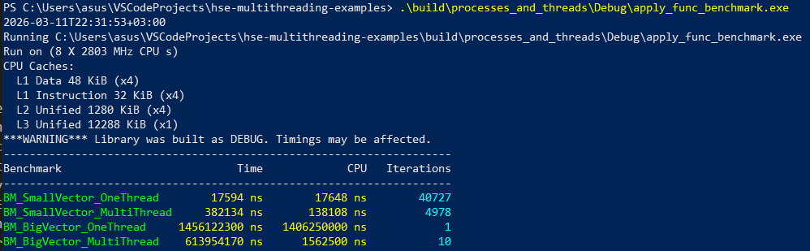

# ApplyFunction tests and benchmarks

## Запуск тестов

Команда: .\build\processes_and_threads\Debug\apply_func_tests.exe

Результат:

[==========] Running 4 tests from 1 test suite.
[----------] Global test environment set-up.
[----------] 4 tests from ApplyFunctionTest
[ RUN ] ApplyFunctionTest.EmptyVector
[ OK ] ApplyFunctionTest.EmptyVector (0 ms)
[ RUN ] ApplyFunctionTest.MultiplyElements
[ OK ] ApplyFunctionTest.MultiplyElements (1 ms)
[ RUN ] ApplyFunctionTest.SingleThread
[ OK ] ApplyFunctionTest.SingleThread (0 ms)
[ RUN ] ApplyFunctionTest.TooManyThreads
[ OK ] ApplyFunctionTest.TooManyThreads (0 ms)
[----------] 4 tests from ApplyFunctionTest (5 ms total)

[==========] 4 tests from 1 test suite ran. (7 ms total)
[ PASSED ] 4 tests.

# Benchmark

Команда: .\build\processes_and_threads\Debug\apply_func_benchmark.exe

Результат:

Benchmark Time CPU Iterations

BM_SmallVector_OneThread 17594 ns 17648 ns 40727
BM_SmallVector_MultiThread 382134 ns 138108 ns 4978
BM_BigVector_OneThread 1456122300 ns 1406250000 ns 1
BM_BigVector_MultiThread 613954170 ns 1562500 ns 10

## Скриншоты запуска

### Тесты

### Бенчмарк

## Вывод

Если вектор маленький и функция простая, то один поток работает быстрее,
потому что создание и запуск нескольких потоков занимает дополнительное время.
Если вектор большой и вычисления более тяжёлые, то несколько потоков работают быстрее,
так как работа делится между ними и выполняется параллельно.
