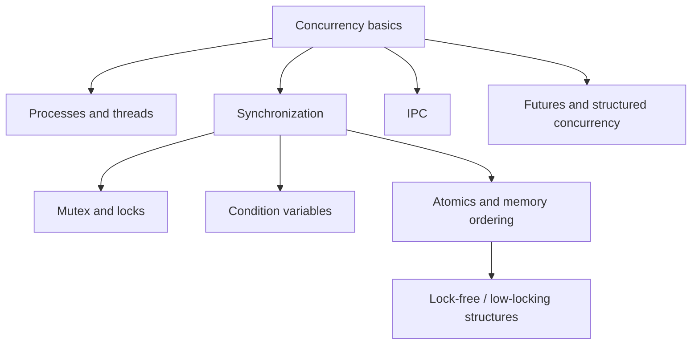

# Topic guide

## Topic map

| Concept | Example location | Notes |
| --- | --- | --- |
| Process creation | `processes_and_threads/fork/` | Demonstrates address-space separation, copy-on-write, and file descriptor behavior. |
| Program replacement | `processes_and_threads/exec/` | Shows `exec`-style execution and descriptor inheritance. |
| POSIX threads | `processes_and_threads/pthread/` | Low-level thread creation and joining. |
| C++ threads | `processes_and_threads/stl/` | `std::thread` and `std::jthread` examples. |
| Mutexes | `synchronization_primitives/mutex/` | Basic locking, RAII locking, recursive/shared mutexes, spinlock, deadlock/livelock examples. |
| Condition variables | `synchronization_primitives/condition_variable/` | Waiting, notification, and predicate-based coordination. |
| Barriers and latches | `synchronization_primitives/barrier/` | One-shot and reusable rendezvous points. |
| Atomics | `synchronization_primitives/atomics/` | Atomic operations, race conditions, compare-and-swap. |
| IPC | `ipc/` and `hw4/` | Pipes, FIFO, signals, semaphores, message queues, shared memory, mmap, shared-memory queue. |
| Futex | `futex/` | Linux-specific low-level blocking and wakeup concepts. |
| Futures | `structured_concurrency/` | `future`, `shared_future`, `async`, `packaged_task`, continuation examples. |
| Channels | `tasks/synchronization_primitives/*channel/` | Exercise-oriented buffered and unbuffered channel implementations with tests and benchmarks. |

## Common pitfalls

- **Race condition:** the result depends on an uncontrolled timing order between operations.
- **Data race:** two threads access the same memory concurrently, at least one access writes, and there is no proper synchronization.
- **Deadlock:** threads wait forever because each holds a resource needed by another thread.
- **Livelock:** threads keep reacting to each other but no useful progress is made.
- **Starvation:** one thread repeatedly loses access to the resource it needs.
- **False sharing:** unrelated data on the same cache line causes unnecessary cache-coherence traffic.
- **Incorrect memory ordering:** atomic operations are present, but the chosen ordering does not establish the intended visibility or sequencing guarantees.
